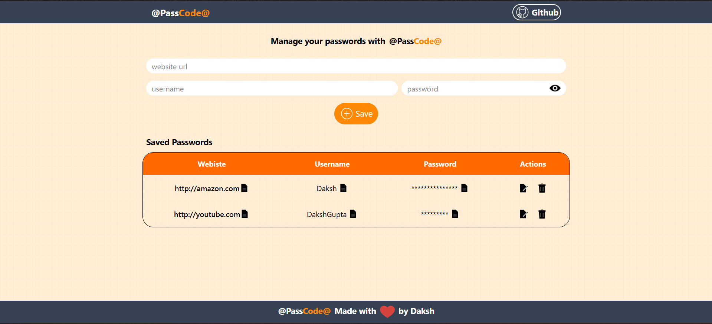

# 🔐 PassCode – Password Manager

A secure and simple password manager built with **React, Express, and MongoDB**.  
This project also contains a **LocalStorage-only version** for quick testing and demonstration.  

---

## 🚀 Features

- Save, edit, and delete passwords securely
- Copy username & password with one click
- Two versions available:
  - **MERN stack version** → Uses MongoDB + Express backend for persistence
  - **LocalStorage version** → Stores passwords in the browser only

---

## 📸 Screenshots


---

## 🛠️ Tech Stack

- **Frontend:** Vite+React, TailwindCSS
- **Backend:** Node.js, Express
- **Database:** MongoDB

---

## 📦 Installation & Setup

### 1. Clone the repo
```bash
git clone https://github.com/Daksh-Official/PassCode.git
cd PassCode
```

### 2. Run the MERN Version

Backend (server)
```
cd backend
npm install
npm run start
```

Frontend (client)
```
cd PassCode
npm install
npm run dev
```

➡️ App will run at http://localhost:5173
➡️ Backend runs on http://localhost:3000

or 

### 3. Run the Local Storage version
```
npm install
npm run dev
```

## 🔒 Security Notes

## 1. ⚠️ The MERN version currently uses a local MongoDB instance.
=> This means all saved passwords are stored together without user accounts.
=> If used by multiple people, their passwords could mix together.
=> It should not be used in production without authentication and user separation.

## 2. The LocalStorage version is only for demonstration purposes.
=> Data is stored in the browser’s local storage.
=> Clearing browser cache will delete all saved passwords.

## ✨ Future Improvements

1. Add user authentication (JWT / OAuth)
2. Implement password encryption before saving in DB
3. Deploy using MongoDB Atlas + Vercel/Render
4. Separate user data to avoid conflicts

## 🤝 Contributing
Pull requests are welcome! If you’d like to improve the project, feel free to fork and submit changes.

Made with ❤️ by Daksh.

Note: this is just another practice project so there might not be any future changes. 
